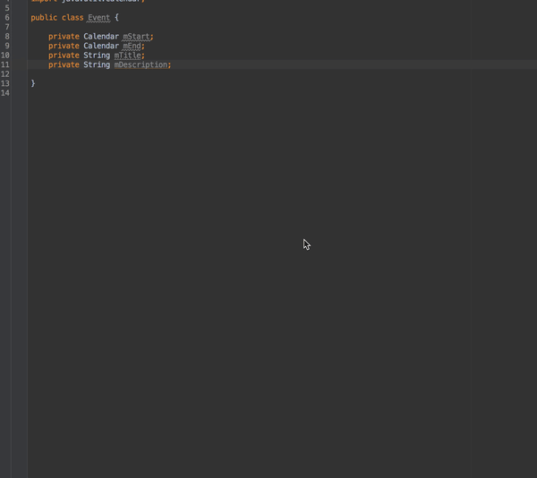

AndroidAccessors
================

IntelliJ/Android Studio plugin to generate proper getters and setters for Android.

Android convention dictates that private member variables be prefaced with an 'm', but the default code generation `Getter and Setter` doesn't handle this so gracefully.  AndroidAccessors provides an alternative which generates much cleaner external methods.

AndroidAccessors now supports private static fields with a leading 's' (as per Google's [Code Style Guidelines](https://source.android.com/source/code-style.html)).

Installation
------------

Using IntelliJ's built-in plugin system:

`Preferences > Plugins > Browse repositories... > Search for "AndroidAccessors" > Install Plugin`

or alternatively, download the .jar and install it manually.

Usage
-----

`Code > Generate ...` will bring up the code generation menu — the default keymapping is `ctrl N` on OS X.  Select `AndroidAccessors` from the menu and it will display a list of all fields in the current class.  Remove any fields you don't need methods for by using the minus sign (-) and click 'OK' to finish.

Developed By
------------

[Jonathon Staff](http://jonathonstaff.com)

License
-------

    Copyright 2014 Jonathon Staff

    Licensed under the Apache License, Version 2.0 (the "License");
    you may not use this file except in compliance with the License.
    You may obtain a copy of the License at

    http://www.apache.org/licenses/LICENSE-2.0

    Unless required by applicable law or agreed to in writing, software
    distributed under the License is distributed on an "AS IS" BASIS,
    WITHOUT WARRANTIES OR CONDITIONS OF ANY KIND, either express or implied.
    See the License for the specific language governing permissions and
    limitations under the License.
